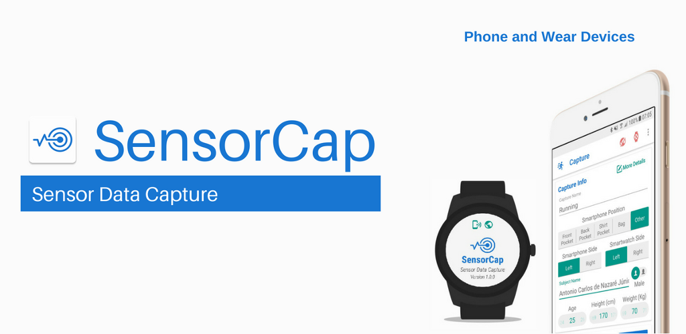

# SensorCap: Sensor Data Capture

SensorCap is an all-in-one sensor data capture compatible with phone and war devices.

It is an Android tool that captures sensor data in user-defined configurations. The purpose is to allow researchers and developers to quickly save sensor data for research, testing and prototyping. The sensors are broadly defined to include Motion, Position and Environment device sensors.

An intuitive user interface makes tasks such as setting up a sensor, enter the capture details and share the sensor data easy. Capture settings include the ability to enable or disable any available sensor and set the sensor capture frequency. Note that some sensors ignore the update interval by internal design, including event based sensors such as step counters and certain orientation sensors.

To allow the data synchronization between phone and wear devices sensor data, we use the NTP time instead the device time.

## Features

* Easy to use user interface;
* The only app that allows capturing wear sensors;
* Capture phone, wear or both devices sensors;
* Allow setting capture info details as device positions and side. Also allow set the subject name, height, weight, genre and age;
* Ability to enable or disable any available device sensor;
* Configure the sensors data generation frequency;
* Save date as binary or CSV files;
* NTP time synchronization;
* Data sharing via email, message apps, cloud storage and others;
* Device time can be visualized by QRCodes for video and sensor synchronization purposes;
* Sounds and vibration to alert the user before capture;

#### Sensors

Whe available, the SensorCap save data from following sensors:

###### Motion Sensors

* Accelerometer
* Gravity
* Gyroscope
* Gyroscope Uncalibrated
* Linear Accelerometer
* Rotation Vector
* Step Detector

###### Position

* Game Vector Rotation
* Geomagnetic Rotation Vector
* Magnetic Field
* Magnetic Field Uncalibrated
* Proximity

###### Environment

* Light
* Pressure
* Ambient Temperature
* Heart Rate
* Relative Humidity

#### Download

## Development

The SensorCap tool is a creation of the [Smart Surveillance Interest Group](http://www.ssig.dcc.ufmg.br), developed by [acnazarejr](https://github.com/acnazarejr), [davibeltrao](https://github.com/davibeltrao) and [vitorcezli](https://github.com/vitorcezli).

#### Contributing

###### Testing

Do you want to be a tester? Join our group! Send a message to [acnazarejr](acnazarejr@gmail.com) we will add you.
We will release apks to test features or to check if bugs have been fixed.

###### Code
If you are a developer and you wish to contribute to the app please fork the project
and submit a pull request on the [devloper branch](https://github.com/acnazarejr/sensorcap/tree/developer).
If you want, you can join us on Telegram - send us a message we will add you!

###### Issues
You can trace the status of known issues [here](https://github.com/acnazarejr/sensorcap/issues),
also feel free to file a new issue (helpful description, screenshots and logcat are appreciated), or send me an [email](mailto:acnazarejr@gmail.com) if you have any questions.

## Licensing
SensorCap is licensed under the [BSD 3-Clause License](https://github.com/acnazarejr/sensorcap/blob/developer/LICENSE).
In addition to the terms set by the BSD 3-Clause License, we ask that if you use any code from this repository that you send us a message to let us know.

#### Third-Party Libraries Used

* [Material Dialogs](https://github.com/afollestad/material-dialogs) – By @afollestad
* [Material Ripple Layout](https://github.com/balysv/material-ripple) – By @balysv
* [AHBottomNavigation](https://github.com/aurelhubert/ahbottomnavigation) – By @aurelhubert
* [IndicatorSeekBar](https://github.com/warkiz/IndicatorSeekBar) – By @warkiz
* [IconSwitch](https://github.com/polyak01/IconSwitch) – By @polyak01
* [ZXing](https://github.com/zxing/zxing) – By ZXing Team
* [ZXing Android Embedded](https://github.com/journeyapps/zxing-android-embedded) – By @journeyapps
* [Number Picker](https://github.com/ShawnLin013/NumberPicker) – By @ShawnLin013
* [RadioRealButton](https://github.com/ceryle/RadioRealButton) – By @ceryle
* [Slide To Act](https://github.com/cortinico/slidetoact) – By @cortinico
* [Dexter](https://github.com/Karumi/Dexter) – By @Karumi
* [ZT-ZIP](https://github.com/zeroturnaround/zt-zip) – By @zeroturnaround
* [MaterialSpinner](https://github.com/jaredrummler/MaterialSpinner) – By @jaredrummler
* [Android Device Names](https://github.com/jaredrummler/AndroidDeviceNames) – By @jaredrummler
* [Apache Commons Net](https://github.com/apache/commons-net) – By @apache
* [Apache Commons CSV](https://github.com/apache/commons-csv) – By @apache